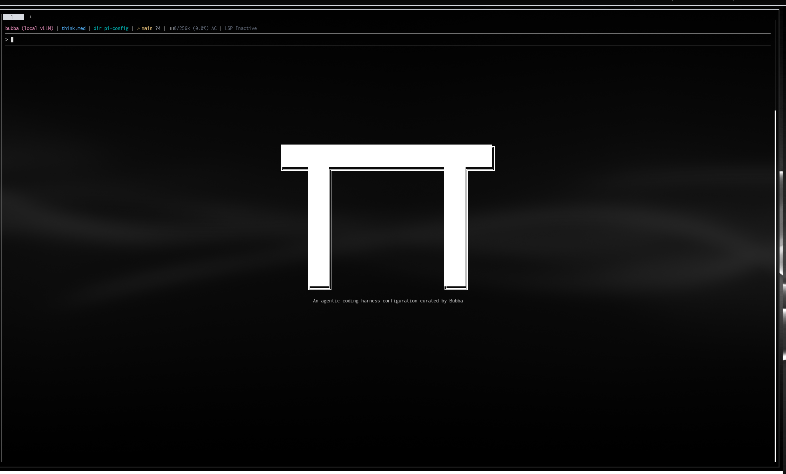
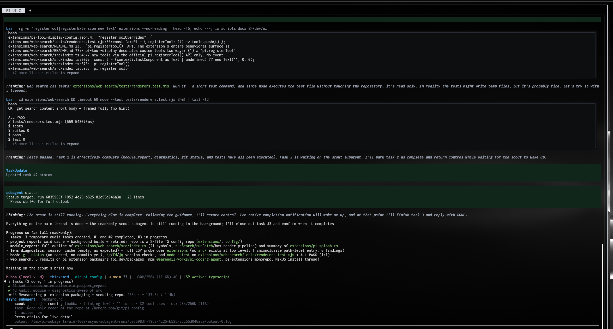

# pi-config

My personal configuration for the [Pi](https://github.com/earendil-works/pi-coding-agent)
coding agent: settings, themes, skills, a startup splash, a local web-search
extension, and the tooling that installs all of it reproducibly.



A deliberately busy session showing tasks, subagents, LSP diagnostics, tests, bash
and web search together:



## What's in here

| Path | Contents |
| --- | --- |
| `manifest.json` | The single source of truth: packages, resources, settings, features |
| `config/` | Settings, instructions, provider/model templates, skills, theme snapshots, dependency lock |
| `extensions/splash/` | Startup splash overlay with the bundled 80×26 artwork |
| `extensions/web-search/` | `web_search` / `fetch_content` / `get_search_content` against a self-hosted SearXNG |
| `scripts/pi-config.py` | `compose`, `lock`, `prepare`, `diff`, `deploy` — the only entry point |
| `tests/` | Composition, deployment, rollback and UI regression tests |
| `docs/composition.md` | How composition, locking, deployment and rollback work |

Features that are personal to my setup (my own model provider, `/btw`, voice,
SearXNG) are declared as separate features so an overlay repository can exclude
each one as a unit and add its own resources. This repository stays complete on
its own and never depends on an overlay.

## Extensions and related projects

| Extension / package | Version | Source | What it does |
| --- | ---: | --- | --- |
| `pi-subagents` | 0.68.0 | npm | Delegation, workflows, tree / FleetView widgets |
| `@nguyenquangthai/pi-ask` | 0.2.0 | npm | Structured question and review dialogs |
| `@tintinweb/pi-tasks` | 0.9.0 | npm | Task tracking and the `/tasks` widget |
| `pi-powerline-footer` | 0.17.1 | npm | Powerline status footer |
| `@narumitw/pi-btw` | 0.58.1 | npm | `/btw` side questions |
| `pi-lens` | 4.1.6 | npm | LSP diagnostics and AST navigation |
| `@sting8k/pi-vcc` | 0.7.2 | npm | Transcript-preserving compaction and recall |
| `pi-tool-display` | 0.5.0 | npm | `edit`/`write` diffs, thinking labels, native user box |
| `pi-image-tools` | 1.4.0 | npm | Image attachments and previews |
| `pi-transcript-window` | 0.3.1 | npm | Window over older transcript entries |
| `pi-boxed-tools` | `9ad64f8d` | [GitHub](https://github.com/BubbatheVTOG/pi-boxed-tools) | Boxed rendering for `read`/`grep`/`find`/`ls`/`bash` |
| `agent-voice` | `8b32166f` | [GitHub](https://github.com/BubbatheVTOG/agent-voice) | Optional spoken announcements with a footer indicator; off by default |
| `pi-local-cloud-toggle` | `a5381780` | [GitHub](https://github.com/BubbatheVTOG/pi-local-cloud-toggle) | Toggle between an existing local model and the previous cloud model |
| `local-web-search` | local | `extensions/web-search/` | Web tools backed by a SearXNG you run yourself |
| `splash` | local | `extensions/splash/` | Startup splash |
| `hyper-term-*` | snapshot | `config/themes/` | Seven theme snapshots; white is the default |
| `plan`, `pi-improver` | local | `config/skills/` | Outcome-first planning; evidence-based Pi improvement |
| `first-principles-researcher` | local | `config/skills/` | Deep research grounded in first principles, verified sources, and explicit uncertainty |

Projects of mine that this configuration builds on:

- **[pi-boxed-tools](https://github.com/BubbatheVTOG/pi-boxed-tools)** renders the
  five text tools in the same box style as user messages. `pi-tool-display` keeps
  the `edit`/`write` diffs, thinking labels and the native user box — the split is
  intentional and the composer checks that the two don't claim the same renderer.
- **[OpenCodeHyperTermTheme](https://github.com/BubbatheVTOG/OpenCodeHyperTermTheme)**
  generates the `hyper-term-*` themes. `config/themes/` is a fallback snapshot so a
  fresh machine looks right before that repository is cloned.
- **[agent-voice](https://github.com/BubbatheVTOG/agent-voice)** speaks agent
  status through a locally installed TTS backend and publishes the `VOICE ON/OFF`
  footer item. It stays off until you turn it on.
- **[pi-local-cloud-toggle](https://github.com/BubbatheVTOG/pi-local-cloud-toggle)**
  switches between the configured existing local model and the previously selected
  cloud model. Its footer item is hidden when the local model is unavailable.
- **first-principles-researcher** is a local skill for breaking complex questions
  down into fundamentals, verifying primary sources, and clearly stating uncertainty.

## Platforms and prerequisites

Required: Pi **0.85.1** exactly (the composer refuses other versions), Node and npm,
Python ≥ 3.12, Git, GNU Stow. There is no npm version pin: the composer probes the
installed npm and, only on releases that gate URL dependencies behind
`--allow-remote`, adds `--allow-remote root` (the pinned archive is a direct,
root-level dependency, so root is the tightest sufficient value); older releases
receive no flag. Nothing here depends on a distribution: no package
manager, no fixed system paths, no architecture assumptions. The npm lock is a
cross-platform union (Linux/macOS/Windows, x64/arm64) and `prepare` installs only
the entries for the host.

Optional, detected at runtime and never required: `img2sixel` (libsixel) for inline
image previews, `shellcheck`/`shfmt` for the shell-script checks. Terminal features
(themes, splash, footer glyphs) depend on the terminal, not the OS.

Verified on Ubuntu 24.04 x86_64. Fedora and Arch are expected to work unchanged;
run `scripts/verify.sh` and a `prepare` into a throwaway directory as the first
check on a new machine — neither touches `~/.pi`.

## Setup

```bash
git clone https://github.com/BubbatheVTOG/pi-config.git && cd pi-config

# 1. Check the composition and run the tests (no network, no Pi started).
python3 scripts/pi-config.py compose
PI_CODING_AGENT_ROOT=/path/to/pi-coding-agent ./scripts/verify.sh

# 2. Build a frozen generation outside the repository (downloads the locked packages,
#    lifecycle scripts ignored).
PI_CODING_AGENT_ROOT=/path/to/pi-coding-agent \
  python3 scripts/pi-config.py prepare --output ~/.local/share/pi-config/generations/1

# 3. See what would change in your live Pi directory. Nothing is written.
python3 scripts/pi-config.py diff \
  --generation ~/.local/share/pi-config/generations/1 \
  --agent-dir ~/.pi/agent --state-dir ~/.local/share/pi-config/state \
  --home ~ --project ~

# 4. Apply exactly the reviewed diff, then /reload in Pi.
python3 scripts/pi-config.py deploy ...same arguments... --expect <diffDigest from step 3>
```

Deployment links resources from the frozen generation into `~/.pi/agent` and writes
local, editable copies of `settings.json`, `models.json` and `AGENTS.md`. Redeploying
reconciles your later edits against the new defaults instead of overwriting them, and
never touches credentials, sessions or other runtime state. Directories it doesn't
own make it refuse rather than adopt or delete anything — see
[docs/composition.md](docs/composition.md) for the rules and for rollback.

Credentials never live here: use Pi's local auth store or environment variables.

## Tests

```bash
PI_CODING_AGENT_ROOT=/path/to/pi-coding-agent \
PI_CANDIDATE_DEPENDENCIES=/path/to/generation/dependencies ./scripts/verify.sh
```

Covers composition and feature exclusion, real Stow deployments into throwaway
targets, rollback with preserved local edits, refusal of unmanaged paths, and renderer
regressions. Tests never call a model or the network.

Extensions run with your full user permissions; the declared inventory is not a
sandbox. Review packages before activating them.
